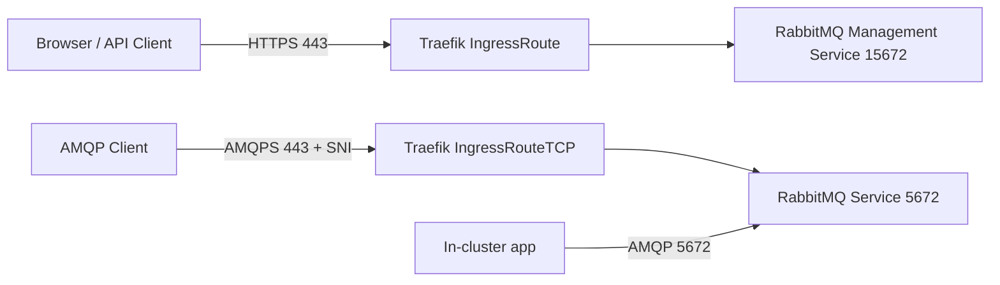

# RabbitMQ + Traefik Setup Guide

This document explains how RabbitMQ was exposed through Traefik for both management (HTTP) and messaging (AMQPS), and how to verify the setup end-to-end.

IMPORTANT: Replace placeholders with your tenant values.

## 1. Setup objective

Expose a single RabbitMQ deployment with two external access paths:

1. Management access over HTTPS for UI/API.
2. Messaging access over AMQPS for publishers/consumers.

At the same time, keep in-cluster AMQP service access for workloads running inside Kubernetes.

## 2. Architecture used



## 3. Protocols and access model

1. HTTPS
- Used for RabbitMQ UI and Management API.
- Endpoint pattern: `https://<RABBITMQ_UI_HOST>`

2. AMQPS
- Used for native AMQP clients through Traefik TCP routing.
- Endpoint pattern: `<RABBITMQ_AMQPS_HOST>:<RABBITMQ_AMQPS_PORT>`

3. AMQP (internal)
- Used by in-cluster apps directly to RabbitMQ service.
- URL pattern: `amqp://<RABBITMQ_USER>:<RABBITMQ_PASS>@<RABBITMQ_INTERNAL_SERVICE>:5672/<VHOST_PATH>`

## 4. Key configuration pattern in values.yaml

File: `deployment-configurations/apps/rabbitmq/envs/nonprod/values.yaml`

Critical parts of the setup:

1. RabbitMQ service exposure for AMQP
- `image.port: 5672`
- `service.port: 5672`

2. Dedicated management service
- Custom Service `rabbitmq-management` on port `15672`.
- Required so HTTP route targets management plugin cleanly.

3. Traefik HTTP route for management
- `kind: IngressRoute`
- `entryPoints: [websecure]`
- Host match: `<RABBITMQ_UI_HOST>`
- Backend: `rabbitmq-management:15672`

4. Traefik TCP route for AMQPS
- `kind: IngressRouteTCP`
- `entryPoints: [websecure]`
- HostSNI match: `<RABBITMQ_AMQPS_HOST>`
- Backend: RabbitMQ service on `5672`

5. TLS behavior for AMQP
- `kind: TLSOption`
- ALPN protocols include `amqp`

## 5. Why this design was chosen

1. Avoid route conflict between HTTP and TCP on the same host.
- HTTP and TCP routers can conflict when sharing `websecure` and identical host/SNI.
- Use separate hostnames:
  - `<RABBITMQ_UI_HOST>` for UI/API
  - `<RABBITMQ_AMQPS_HOST>` for AMQPS

2. Keep management and messaging ports separated.
- UI/API on `15672` backend.
- AMQP broker on `5672` backend.

3. Support both customer test paths.
- HTTP-based publishing via app/API.
- HTTP-based consumption checks via app/API.
- Native AMQP publishing via AMQPS clients.

## 6. Rollout sequence

1. Deploy RabbitMQ values with service ports and custom resources.
2. Sync app and confirm resources are created:
- Service `rabbitmq-management`
- IngressRoute (HTTP)
- IngressRouteTCP (TCP)
- TLSOption
3. Confirm RabbitMQ pod is healthy.
4. Verify management URL opens over HTTPS.
5. Verify AMQPS client can connect and publish.

## 7. Validation steps

### 7.1 Validate management UI/API path

```bash
curl -u "<RABBITMQ_USER>:<RABBITMQ_PASS>" \
  -s "https://<RABBITMQ_UI_HOST>/api/overview"
```

Expected:
1. HTTP 200 response.
2. JSON payload from RabbitMQ Management API.

### 7.2 Validate AMQPS publish path

Use repository publisher:

```bash
cd /workspaces/glueops/mmos-rmq-poc
python3 -m venv .venv
source .venv/bin/activate
python3 -m pip install -r requirements-publisher.txt
python3 publish_amqp.py --message "hello over amqps"
```

Expected output includes:

```text
published queue=<QUEUE_NAME> bytes=<N> host=<RABBITMQ_AMQPS_HOST>:<RABBITMQ_AMQPS_PORT> vhost=<RABBITMQ_VHOST>
```

### 7.3 Validate consumer receive path

1. App status endpoint:

```bash
curl -s "https://<APP_HTTP_HOST>/rmq-status"
```

Expected:
1. `connected: true`
2. `messages` and `consumers` values are present.

2. Consume one message via app route (default behavior requeues message so queue depth is preserved):

```bash
curl -X POST "https://<APP_HTTP_HOST>/consume" \
  -H "Content-Type: application/json" \
  -d '{"queue":"<QUEUE_NAME>","requeue":true}'
```

Expected response fields:
1. `message_found`
2. `payload`
3. `messages_before`
4. `messages_after`

3. If you need a destructive read for validation, set `requeue:false`:

```bash
curl -X POST "https://<APP_HTTP_HOST>/consume" \
  -H "Content-Type: application/json" \
  -d '{"queue":"<QUEUE_NAME>","requeue":false}'
```

Expected:
1. `message_found: true` when a message exists.
2. `messages_after` may be lower than `messages_before`.

4. App logs should contain:
- `connected to RabbitMQ and consuming queue=...`
- `received routing_key=... payload=...`

Note:
- Queue depth may stay near `0` if consumer ACKs messages immediately.

## 8. Local testing modes

### 8.1 Local publisher only, cluster RabbitMQ

```bash
cd /workspaces/glueops/mmos-rmq-poc
python3 -m venv .venv
source .venv/bin/activate
python3 -m pip install -r requirements-publisher.txt
python3 publish_amqp.py \
  --host <RABBITMQ_AMQPS_HOST> \
  --port <RABBITMQ_AMQPS_PORT> \
  --username <RABBITMQ_USER> \
  --password <RABBITMQ_PASS> \
  --vhost <RABBITMQ_VHOST> \
  --queue <QUEUE_NAME> \
  --message "hello from local"
```

### 8.2 Local app + cluster RabbitMQ

```bash
cd /workspaces/glueops/mmos-rmq-poc

RABBITMQ_URL='amqps://<RABBITMQ_USER>:<RABBITMQ_PASS>@<RABBITMQ_AMQPS_HOST>:<RABBITMQ_AMQPS_PORT>/<VHOST_PATH>' \
RABBITMQ_QUEUE='<QUEUE_NAME>' \
HTTP_ADDR=':8080' \
CONSUMER_NAME='mmos-rmq-poc-local' \
go run .
```

Then publish to local app HTTP endpoint:

```bash
curl -X POST "http://localhost:8080/publish" \
  -H "Content-Type: application/json" \
  -d '{"queue":"<QUEUE_NAME>","body":"hello via local http"}'
```

Then verify via local consumer check route:

```bash
curl -X POST "http://localhost:8080/consume" \
  -H "Content-Type: application/json" \
  -d '{"queue":"<QUEUE_NAME>","requeue":true}'
```

## 9. Common issues observed during setup

1. HTTP 404 on management URL
- Cause: HTTP and TCP route collision or incorrect backend service for 15672.
- Fix: separate UI and AMQPS hostnames; ensure IngressRoute points to management service.

2. Traefik TCP route shows missing service
- Cause: IngressRouteTCP backend reference mismatch.
- Fix: verify service name/namespace and port in IngressRouteTCP.

3. `connection refused` to `:5672`
- Cause: RabbitMQ service port not exposed.
- Fix: set both `image.port` and `service.port` to `5672`.

4. `username or password not allowed`
- Cause: credential typo or wrong vhost.
- Fix: verify `<RABBITMQ_USER>`, `<RABBITMQ_PASS>`, and `<RABBITMQ_VHOST>`.

5. `/publish` returns app status payload
- Cause: old app image still running.
- Fix: deploy immutable image tag and sync.

6. `/consume` always returns `message_found: false`
- Cause: active background consumer drains messages immediately.
- Fix: publish and consume quickly, or temporarily stop/scale down background consumer when inspecting backlog.
